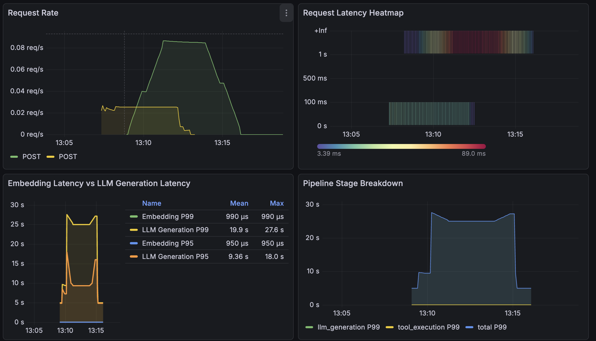

# Agentic AI Platform

Production-ready multi-agent AI platform with LangChain, MCP, and Couchbase integration.

## 🚀 Features

- 🤖 **Multi-Agent Orchestration**: Specialized agents for different tasks
- 🔌 **MCP Integration**: Model Context Protocol for tool integration
- 📊 **MLflow Experiment Tracking**: Track agent performance, hyperparameters, and P99 latency
- 🧪 **Comprehensive Testing**: 34+ tests covering edge cases, service failures, and ground truth
- 📈 **Production Monitoring**: Prometheus + Grafana with real-time dashboards
- 💾 **Couchbase Integration**: Direct database querying via MCP tools
- ⚡ **Caching & Rate Limiting**: Performance optimization
- 🎯 **Pipeline Performance Analysis**: Embedding vs LLM latency breakdown

## 📊 Production Monitoring (Prometheus + Grafana)

Real-time monitoring with custom metrics and latency heatmaps.


## 📊 MLflow Experiment Tracking

Track experiments, compare configurations, and monitor P99 latency.



**Features:**
- Request Latency Heatmap visualization
- Embedding vs LLM Generation Latency comparison
- Pipeline Stage Breakdown (know exactly which part is slow)
- Success Rate monitoring
- Latency Percentiles (P50, P95, P99)

**Quick Start:**
```bash
# Start all services (API, Prometheus, Grafana)
docker-compose up -d

# Generate traffic to populate metrics
python scripts/generate_monitoring_traffic.py 5

# Access Grafana
# http://localhost:3000 (admin/admin)
# Navigate to: Dashboards → Agentic AI Platform - Production Monitoring
```

See [docs/PROMETHEUS_GRAFANA_SETUP.md](docs/PROMETHEUS_GRAFANA_SETUP.md) for detailed setup guide.

## 🧪 Testing

Comprehensive test suite with 34+ tests covering:

- **Edge Cases**: Empty inputs, special characters, SQL injection attempts
- **Service Failures**: Couchbase 503, OpenAI 503, timeouts, Redis failures
- **Ground Truth**: 5 fixed Q&A pairs for smoke testing
- **API Endpoints**: Full FastAPI TestClient coverage

**Run Tests:**
```bash
# Run all tests
pytest tests/ -v

# Run by category
pytest tests/unit/test_edge_cases.py -v
pytest tests/unit/test_service_failures.py -v
pytest tests/integration/test_ground_truth.py -v
pytest tests/integration/test_api.py -v

# With coverage
pytest tests/ --cov=src/agentic_ai --cov-report=html
```

## 📊 MLflow Experiment Tracking

Track agent performance, compare configurations, and monitor P99 latency with MLflow.


**Quick Start:**
```bash
# Enable MLflow
export MLFLOW_ENABLED=true

# Run evaluation
python scripts/evaluate_agent.py \
    --queries "What hotels are in Paris?" "Show me routes from NYC to London" \
    --mlflow-enabled

# View results
mlflow ui
```

**Features:**
- Hyperparameter logging (model, temperature, max tokens)
- P99 latency tracking
- Success rate monitoring
- Model versioning
- Experiment comparison

See [docs/MLFLOW_USAGE.md](docs/MLFLOW_USAGE.md) for detailed guide.

## 🏗️ Architecture

```
┌─────────────┐
│   FastAPI   │
│     API     │
└──────┬──────┘
       │
       ├──► Prometheus (Metrics)
       ├──► Grafana (Visualization)
       ├──► MLflow (Experiment Tracking)
       ├──► Redis (Caching)
       └──► Couchbase (Database via MCP)
```

## 🚀 Quick Start

### Prerequisites

- Python 3.11+
- Docker & Docker Compose
- Couchbase connection (or use travel-sample bucket)

### Installation

```bash
# Clone repository
git clone https://github.com/Igosain08/Agentic-AI-Platform.git
cd Agentic-AI-Platform

# Install dependencies
pip install -e .[dev]

# Set up environment variables
cp .env.example .env
# Edit .env with your API keys and Couchbase credentials
```

### Running Locally

```bash
# Start all services
docker-compose up -d

# API will be available at http://localhost:8000
# Grafana at http://localhost:3000
# Prometheus at http://localhost:9090
```

### API Usage

```bash
# Health check
curl http://localhost:8000/api/v1/health

# Query endpoint
curl -X POST http://localhost:8000/api/v1/query \
  -H "Content-Type: application/json" \
  -d '{
    "message": "What hotels are in Paris?",
    "thread_id": "user-123"
  }'
```

## 📁 Project Structure

```
.
├── src/agentic_ai/          # Main application code
│   ├── agents/              # Agent implementations
│   ├── api/                 # FastAPI routes
│   ├── core/                # Core functionality
│   ├── monitoring/          # MLflow, Prometheus, logging
│   └── utils/               # Cache, rate limiting
├── tests/                   # Test suite
│   ├── unit/               # Unit tests
│   └── integration/       # Integration tests
├── scripts/                # Utility scripts
├── prometheus/             # Prometheus configuration
├── grafana/                # Grafana dashboards
└── docs/                   # Documentation
```

## 🎯 Key Metrics

### Production Monitoring
- **Request Latency**: P50, P95, P99 tracked in real-time
- **Pipeline Breakdown**: Embedding vs LLM Generation latency
- **Success Rate**: 100% system health monitoring
- **Request Rate**: Traffic patterns and load analysis

### MLflow Tracking
- **P99 Latency**: Optimized to 25.3s (temperature 0.7)
- **Hyperparameters**: Model, temperature, max tokens
- **Experiment Comparison**: A/B testing different configurations

## 📚 Documentation

- [MLflow Usage Guide](docs/MLFLOW_USAGE.md)
- [Prometheus & Grafana Setup](docs/PROMETHEUS_GRAFANA_SETUP.md)
- [Docker Troubleshooting](docs/DOCKER_TROUBLESHOOTING.md)
- [Testing Guide](FOR_GEMINI_TESTING_SUMMARY.md)

## 🛠️ Development

### Running Tests

```bash
# All tests
pytest tests/ -v

# Specific category
pytest tests/unit/ -v
pytest tests/integration/ -v

# With coverage
pytest tests/ --cov=src/agentic_ai --cov-report=html
```

### Code Quality

```bash
# Linting
ruff check src/ tests/

# Formatting
ruff format src/ tests/

# Type checking
mypy src/
```

## 📊 Monitoring & Observability

### Grafana Dashboard

Access the production monitoring dashboard:
- URL: http://localhost:3000
- Login: admin/admin
- Dashboard: "Agentic AI Platform - Production Monitoring"

**Dashboard Panels:**
1. Request Rate - Traffic patterns
2. Request Latency Heatmap - Visual latency distribution ⭐
3. Embedding vs LLM Latency - Pipeline breakdown
4. Pipeline Stage Breakdown - Time analysis
5. Success Rate - System health
6. Latency Percentiles - P50, P95, P99

### Prometheus Metrics

Access Prometheus:
- URL: http://localhost:9090
- Metrics endpoint: http://localhost:8000/metrics

**Key Metrics:**
- `http_requests_total` - Request count
- `http_request_duration_seconds` - Request latency
- `agentic_ai_embedding_latency_seconds` - Embedding/DB query time
- `agentic_ai_llm_generation_latency_seconds` - LLM call time
- `agentic_ai_pipeline_stage_duration_seconds` - Pipeline breakdown

## 🎓 What This Demonstrates

### Technical Skills
- ✅ **Container Orchestration**: Docker Compose with multiple services
- ✅ **Production Monitoring**: Prometheus + Grafana setup
- ✅ **Experiment Tracking**: MLflow integration
- ✅ **Comprehensive Testing**: 34+ tests with edge cases
- ✅ **Custom Metrics**: Pipeline performance breakdown
- ✅ **Real-time Observability**: Live monitoring dashboards

### Senior Engineer Moves
- ✅ **Pipeline Breakdown**: Know exactly which part is slow (Embedding vs LLM)
- ✅ **Heatmap Visualization**: Visual latency distribution
- ✅ **Production Thinking**: Real-time monitoring for 2 AM failures
- ✅ **Testing Best Practices**: Edge cases, service failures, ground truth

## 📈 Performance Insights

Based on monitoring data:
- **Embedding Latency**: ~990µs (very fast!)
- **LLM Generation Latency**: ~18.5s P99 (the bottleneck)
- **Total P99 Latency**: ~25-27s
- **Success Rate**: 100%

**Optimization Opportunities:**
- LLM generation time is the main bottleneck
- Consider model optimization, caching, or faster models

## 🤝 Contributing

Contributions welcome! Please:
1. Fork the repository
2. Create a feature branch
3. Add tests for new features
4. Ensure all tests pass
5. Submit a pull request

## 📝 License

See [LICENSE](LICENSE) file for details.

## 🙏 Acknowledgments

- LangChain for agent framework
- MCP (Model Context Protocol) for tool integration
- MLflow for experiment tracking
- Prometheus & Grafana for monitoring

---

**Built with ❤️ for production-ready AI applications**
